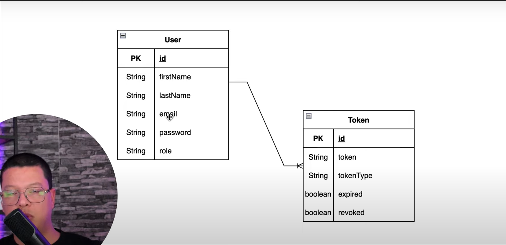

# Spring Security JWT Implementation Project

> [!NOTE]
>
> Youtube Links
>
> Link 1: [Spring boot 3.0 - Secure your API with JWT Token [2023]](https://youtu.be/BVdQ3iuovg0?si=tEYIqX8U-E2-6mag)
>
> Link 2: [How to Logout from Spring Security - JWT](https://youtu.be/0GGFZdYe-FY?si=ZPioixVbfXf1_Q74)

> GitHub Link: [Source Code](https://github.com/ali-bouali/spring-boot-3-jwt-security)

## Architecture

### Spring Initializr Project URL:
Link to [download starter project](https://start.spring.io/#!type=maven-project&language=java&platformVersion=3.2.0&packaging=jar&jvmVersion=17&groupId=com.revs&artifactId=jwtsecurity&name=jwtsecurity&description=Demo%20project%20for%20Spring%20Boot%20Security&packageName=com.revs.jwtsecurity&dependencies=web,security,data-jpa,postgresql,lombok,devtools,actuator)

### Dependencies
1. spring-starter-web
2. spring-starter-security
3. spring-starter-data-jpa
4. spring-postgres-driver
5. spring-lombok
6. jjwt-api
7. jjwt-impl
8. jjwt-jackson

### JWT Website
Click here to go to [JWT Website](https://jwt.io/)

JWT - json web token, compact url safe

Used to share the claims between two parties. JWT claims are pieces of information and they are json objects inside JWT.

JWT is three parts -> Header(Algorithm and Token Type) + Payload(Claims) + Signature()

There are three types of claims -> registered claims, public claims and private claims.

