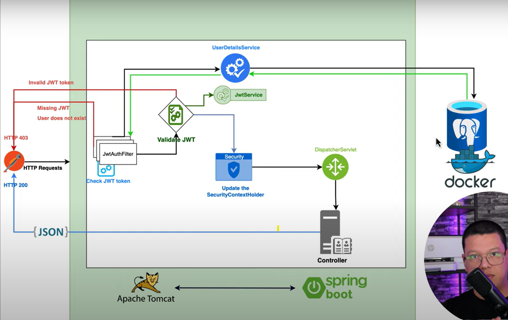
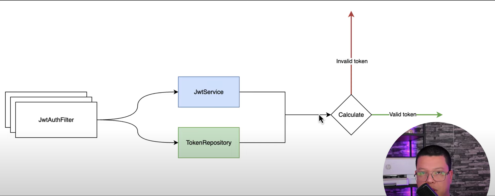

# Spring Security JWT Implementation Project

> [!NOTE]
>
> Youtube Links
>
> Link 1: [Spring boot 3.0 - Secure your API with JWT Token [2023]](https://youtu.be/BVdQ3iuovg0?si=tEYIqX8U-E2-6mag)
>
> Link 2: [How to Logout from Spring Security - JWT](https://youtu.be/0GGFZdYe-FY?si=ZPioixVbfXf1_Q74)

> GitHub Link: [Source Code](https://github.com/ali-bouali/spring-boot-3-jwt-security)

### Architecture




### Spring Initializr Project URL:
Link to [download starter project](https://start.spring.io/#!type=maven-project&language=java&platformVersion=3.2.0&packaging=jar&jvmVersion=17&groupId=com.revs&artifactId=jwtsecurity&name=jwtsecurity&description=Demo%20project%20for%20Spring%20Boot%20Security&packageName=com.revs.jwtsecurity&dependencies=web,security,data-jpa,postgresql,lombok,devtools,actuator)

### Dependencies
1. spring-starter-web
2. spring-starter-security
3. spring-starter-data-jpa
4. spring-postgres-driver
5. spring-lombok
6. jjwt-api
7. jjwt-impl
8. jjwt-jackson

### JWT Website
Click here to go to [JWT Website](https://jwt.io/)

JWT - json web token, compact url safe

Used to share the claims between two parties. JWT claims are pieces of information and they are json objects inside JWT.

JWT is three parts -> Header(Algorithm and Token Type) + Payload(Claims) + Signature()

There are three types of claims -> registered claims, public claims and private claims.

## JWT Logout Meachnism
Youtube Link: [How to Logout from Spring Security - JWT](https://youtu.be/0GGFZdYe-FY?si=i1NLjeOsvWLREIrX)

## JWT Refresh Token
YouTube Link: [Spring Security - Refresh token](https://youtu.be/EsVybSJr7zU?si=ibbelcO4z1Iu-w6t)

## Roles and Permissions Based Authorization
YouTube Link: [Spring boot 3 & Spring security 6 - Roles and Permissions Based Authorization Explained!](https://youtu.be/mq5oUXcAXL4?si=HD8MCfBBHoCyQ8Ag)

## Open API/Swagger UI Implementation
YouTube Link: [Spring boot 3 - OpenApi Documentation | Swagger UI](https://youtu.be/2o_3hjUPAfQ?si=ULpVHw843ds_b6QR)

Swagger API: used to document REST API Applications

click [here](https://springdoc.org/) to visit OpenAPI official Documetation

Add below dependency to your pom.xml to generate api documentation

```xml
<dependency>
    <groupId>org.springdoc</groupId>
    <artifactId>springdoc-openapi-starter-webmvc-ui</artifactId>
    <version>2.3.0</version>
</dependency>
<!-- Add the below dependency to avaid validation exceptions-->
<dependency>
    <groupId>org.springframework.boot</groupId>
    <artifactId>spring-boot-starter-validation</artifactId>
</dependency>
```

API Documentation will be available at http://localhost:8080/swagger-ui/index.html

## JPA Auditing for Spring boot and Spring Security
YouTube Link: [JPA Auditing for Spring boot and Spring Security](https://youtu.be/lGULtrZqk-c?si=8vz2aWinArg8u5-G)

## Spring security | Change password
YouTube Link: [Spring security | Change password](https://youtu.be/kpLpFpQUGv4?si=VGONJzYp9rfJIMt2)


